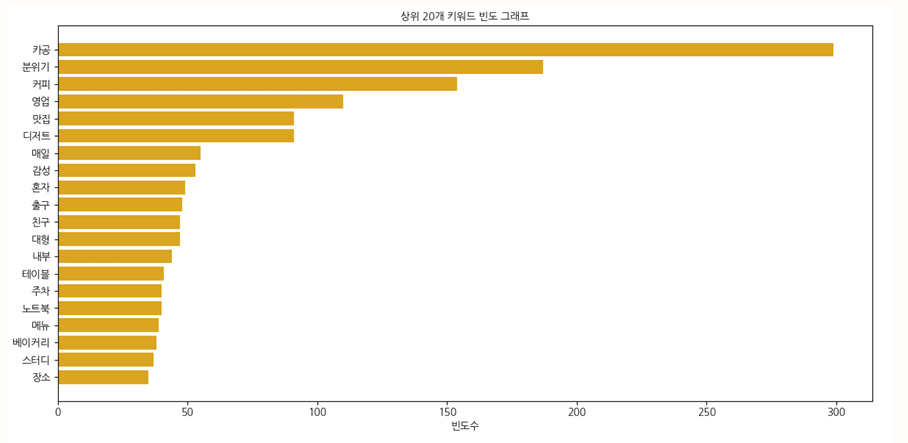
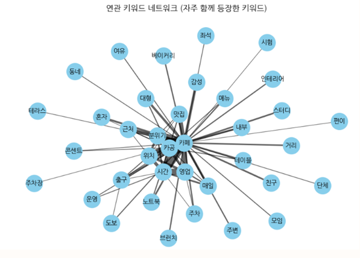

# ☕ 카페 러너가 선호하는 카페 데이터 분석

## 프로젝트 개요
카페에서 공부하거나 작업하는 ‘카페 러너(Cafe Learner)’가 선호하는 카페의 조건을
네이버 블로그 리뷰 데이터를 기반으로 분석한 텍스트 마이닝 프로젝트입니다.

- 기간: 2025년 상반기 졸업작품
- 참여 인원: 3명
- 역할: 데이터 수집, 전처리, 키워드 분석, 시각화

## 문제 정의
카페 러너는 조용한 분위기, 좌석 환경, 콘센트 유무 등 다양한 요소를 고려하지만  
어떤 카페가 실제로 학습에 적합한지에 대한 정량적 정보는 부족한 상황입니다.
본 프로젝트는 리뷰 데이터를 활용해 카페 러너가 중요하게 여기는 요소를 도출하는 것을 목표로 합니다.

## 데이터 수집
- 출처: 네이버 블로그
- 키워드: ‘서울 공부하기 좋은 카페’
- 수집 규모: 약 1,100개의 리뷰 문장
- 수집 방법: Python 기반 크롤링 (Google Colab 환경)

## 분석 및 처리 과정
1. 텍스트 정제 및 형태소 분석
2. 키워드 빈도 분석
3. 워드 클라우드 시각화
4. 키워드 동시 출현(Co-occurrence) 네트워크 분석
5. 일반 카페 vs 스터디 카페 키워드 비교

## 주요 분석 결과
- 상위 핵심 키워드: `카공`, `분위기`, `커피`, `영업`, `맛집`
- 카공 키워드 중심으로 `노트북`, `테이블`, `스터디`, `혼자` 등의 학습 관련 키워드가 강하게 연결됨
- 일반 카페:
  - 감성적 분위기, 여유, 다양한 메뉴 중시
- 스터디 카페:
  - 효율성, 편의성, 집중 환경 중시
- 공통적으로 중요하게 나타난 요소:
  - 영업시간, 분위기, 주차

## 분석 결과 시각화 예시

분석 결과 이미지 보기

### 키워드 빈도 분석

### 워드 클라우드

### 연관 키워드 네트워크

### 카페 유형별 키워드 비교

## 결론
카페 러너는 단순히 조용한 공간뿐만 아니라  
노트북 사용 가능 여부, 좌석 구성, 영업시간, 감성적 분위기와 실용성을 함께 고려한다는 점을 확인했습니다.

## 한계점 및 향후 개선
- 서울 지역으로 한정된 데이터로 인한 편향 가능성
- 크롤링 범위(API 제한)로 인한 데이터 규모 제한
- 향후 개선 방향:
  - 지역 및 카페 유형 확장
  - 자동 수집 주기 설정
  - 최신 리뷰 가중치 적용

## 사용 기술
- 개발 환경: Google Colab, Python
- 데이터 처리: Pandas, NumPy
- 자연어 처리: KoNLPy(Okt), re
- 텍스트 분석: Counter, 키워드 빈도 분석
- 네트워크 분석: NetworkX, 키워드 동시 출현 분석
- 시각화: Matplotlib, WordCloud, matplotlib-venn

## 발표 자료
- `카페러너가선호하는카페데이터분석.pdf` 참고
